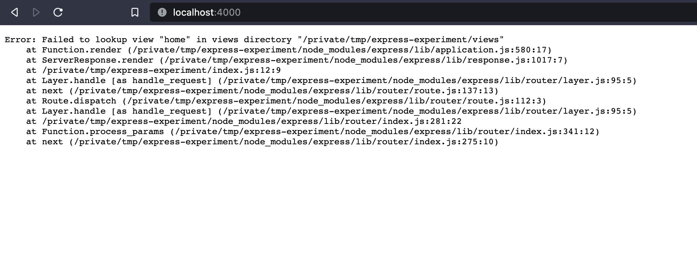

# The curious case of `res.render`

If you have ever tried to build a website, chances are you have encountered `res.render`.

If you program in `PHP (Laravel)`, you know it as `view`.

```php
Route::get('/', function () {
  return view("home");
});

```

If you are coming from the land of `Ruby on Rails`, you know it as `render`.

```ruby
def index
  render "home"
end
```

If you like yourself some `ExpressJS(Node)`, you may finally know it in the form we are addressing it, the infamous `res.render`.

```javascript
app.get("/", function (req, res) {
  res.render("home");
});
```

Despite being a creature of the multiverse, and existing in so many forms, it has a relatively simple definition.

`res.render` is a function that takes one argument, some sort of name, which repersents some static content, for our concerns, `HTML`, and sends back that as response to client requests.

<br />

# What's so curious about it?

When I was thinking about adding template rendering support in [NRAF](https://github.com/vipulbhj/nraf), a very interesting question popped up.

How would I, as a library author, know where does the template exist in the user's project? Sure, I can ask them to tell me an absolute path to that file, but other frameworks like `express` support defaults without asking the user to provide any.

And so I wondered,

**How do they even know where are the files ??, are they somehow finding the absolute path of the file, which call the `render` function and thus find the path to root of the project. But, how the hell do you find the path of a file that calls a function ??**

And I had seen them all, `the Pledge`, `the Turn` and `the Prestige`, accepted the magic trick got me. And started looking for clues on what made it tick.

## The road called "Obvious"

As my first instinct was to somehow find the path of the file which called `render`, I started by googling ["how to find the path of a file which called some function"](https://www.google.com/search?q=how+to+find+the+path+of+a+file+which+called+some+function), which to my surprise let to some legit [information](https://stackoverflow.com/questions/13227489/how-can-one-get-the-file-path-of-the-caller-function-in-node-js).

While this is "a way" of hacking together a solution, this just didn't seem right.

This would be extremely bad for performance, and shouts `HACK-IST` from a distance.

Moreover, it just didn't feel right, so I decided to dive into `ExpressJS` source code and find how they are doing it.

**P.S: _Thank you open source._**

## Finding the secret sauce

I had some prior experience with the ExpressJS source code, because, in the super early days of [NRAF](https://github.com/vipulbhj/nraf), I looked in there for inspiration as well as, validation of my ideas and sometimes just pure learning.

Being familiar with the project structure, I straight away started looking for how they were handing defaults paths for rendering templates.

> The good thing with the source code of express is, it's not huge and overly complicated by fancy build tools, so it's approachable to people of all experience levels.

I initially started by looking at what [default settings](https://github.com/expressjs/express/blob/ea537d907d61dc693587fd41aab024e9df2e14b1/lib/application.js#L70) are used when you initialized an app.

[Inside the initalization function, we see this.](https://github.com/expressjs/express/blob/ea537d907d61dc693587fd41aab024e9df2e14b1/lib/application.js#L115)

`this.set('views', resolve('views'));`

which indicates, it looks for a folder called `views`, which is expected to have the templates.

This is a documented default, so no surprises thus far.

But the question remains, how does it even know where to look for the folder.

Next, lets look at the `resolve` function.

```js
View.prototype.resolve = function resolve(dir, file) {
  var ext = this.ext;

  // <path>.<ext>
  var path = join(dir, file);
  var stat = tryStat(path);

  if (stat && stat.isFile()) {
    return path;
  }

  // <path>/index.<ext>
  path = join(dir, basename(file, ext), "index" + ext);
  stat = tryStat(path);

  if (stat && stat.isFile()) {
    return path;
  }
};
```

What, how, wait, huh !!

I expected this function to do something related to finding the `views` folder, but it doesn't, all it does, is check if the given path is a file or a directory and accordingly return a new path, joining the two.

This was strange, and at this point I got really confused, I expected to see something very clear on how they location the absolute path of your project, but it seems like they don't and just magically know somehow.

After that I was just browsing random files in the project, to find some more hints on how they do it when I suddenly noticed this [lookup](https://github.com/expressjs/express/blob/ea537d907d61dc693587fd41aab024e9df2e14b1/lib/view.js#L104) function.

```js
View.prototype.lookup = function lookup(name) {
  var path;
  var roots = [].concat(this.root);

  debug('lookup "%s"', name);

  for (var i = 0; i < roots.length && !path; i++) {
    var root = roots[i];

    // resolve the path
    var loc = resolve(root, name);
    var dir = dirname(loc);
    var file = basename(loc);

    // resolve the file
    path = this.resolve(dir, file);
  }

  return path;
};
```

I had already gone past this `roots` variable thingy a few times already, and while it seemed important, I didn't understand what it was, but then it suddenly hit me, `roots`, it's named `roots`.

So, I quickly opened up my terminal and starter typing.

```bash
cd /tmp
mkdir express-experiment
cd express-experiment
yarn init -y
yarn add express ejs
vim index.js
```

At this point I had an express project initialized, then I created an endpoint to test my hypothesis.

```js
const express = require("express");
const app = express();
const PORT = 3000;

app.get("/", (req, res) => {
  res.render("home");
});

app.listen(PORT);
```

What this should do is, use the defaults and look for a folder called `views` in my project and render a file called `home.ejs`.

But there is no `views` folder in my project folder.

```
node_modules/
  > express

index.js
```

But what if, I add a views folder outside my project folder. And so I made one.

```bash
cd ..
mkdir views
cd views
vim hello.ejs
```

and added a `hello.ejs` like in it.

```html
<h1>Hello World from Views outside the project folder</h1>
```

Then I navigated back into the project folder and executed the code.

```bash
cd express-experiment
node index.js
```

open my browser, went to `http://localhost:3000`, and there it was



just as I had expected.

## So, what just happened?

Well people, we found what makes the magic trick tick, and it's so clever, I am still giggling about it, but yet so obvious, I feel a little dumb I didn't see it before.

So, how does `express` know, where to find your `views` folder. Well, it doesn't know, but it knows all the possible places it might be at.

So, the smart people who wrote the `express` framework, noticed a key detail about how your dependencies are stored inside your projects. The `node_modules` folder is part of the project itself, which means any dependencies you install, will be installed as a subfolder in your project, which inturn means, this `views` folder that we are looking for has to be somewhere in this chain.

And that's exactly what they do, they removed each level of depth from the absolute path, and look for this folder called `views` and whenever they find it, `BINGO`.

I genuinely laughed for five minutes straights after I saw that error, only the few rare times I laughed after seeing an error :p (>\_<)

<br />

# How I am going to implement it in [NRAF](https://github.com/vipulbhj/nraf)

While I liked how they did it, it also made me think about how this for one can cause a lot of confusion, if not any security issues.

Imagine a situation where you have some folder structure like this.

```
learning/
  views/
    home.ejs
  coding/
    express-practice/
      index.js
```

I know it's a bit of a stretched of imagination, but in this case, if you forget to add a `views` folder to your project, it will starts rending files from the `views` folder, some level higher up the path, which might endup causing a lot of confusion and become a frustrating problem.

The probability of this happening to someone who is just starting is very realistic, and so to avoid all this, [NRAF](https://github.com/vipulbhj/nraf) will require you to tell the path of your template folder explicitly, which is optional in `express`.

We will use a syntax similar to how you can do it in express, using `app.set('views', path.join(__dirname, 'views'));`, but would be a mandatory thing to do, and if you forget, it will show you a nice error message telling you what you need to do :p

_And that's about it, thank you so much for reading my brain dump. Hope it wasn't all blabbering._

_**If you wanna talk further about anything, open an issue, or leave a star on [NRAF](https://github.com/vipulbhj/nraf), maybe :)**_

Until next time. Peace
