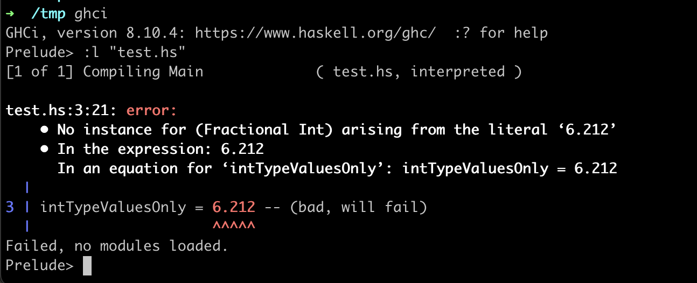

# Content in Draft / Early preview, if you find any issues pretend you didn't see them.

# Haskell 101: A glance

## Introduction

_A `general-purpose, statically typed, purely functional, lazy evaluated` programming language, that will hurt you more than **your first breakup(no exaggeration).**_

**_A language that will make you feel like a noob, doesn't matter how many years of experience you have writing lame `JAVA` code._**

Born out of the complexities of [Lambda Calculus](https://en.wikipedia.org/wiki/Lambda_calculus) and [Category Theory](https://en.wikipedia.org/wiki/Category_theory), in the dark valleys of [Glasgow](https://en.wikipedia.org/wiki/Glasgow_Haskell_Compiler), `Haskell` nerds will make sure you leave that book after the preface and never come back because you realize, you are too dumb for this shit.

**A language so gorgeous, you will fall in love. A language so powerful, it will make your brain bigger(like physically bigger). A language so sick, even I don't understand half of it(but the other half, that's some kick-ass stuff).**

## `Step[0]`

If you plan to try some of the examples, I would highly recommend setting up `Haskell` locally on your machine. You can follow [this](https://www.haskell.org/platform/) guide to download and set up `ghc` and `ghci`, we will use `ghci` for all examples.

**`Can't I just use an online compiler ??`**

Well, in theory sure, if you google, you can find some options, I have used [Haskell replit](https://replit.com/languages/haskell) in the past, **_but_**(and "a big fat `but`, as far as `but's` go") there is a problem, you see currently you are a `Haskell` baby, all you know is and do is cry, but these `REPL` environments are designed for grownups. And if I were to take you from a baby to grownup, we will have to talk about, what `purely functional` really means, and how `IO` is always impure by design, and then I will have to tell you about how `Haskell` ended up going around that issue using `IO Monad`, but then you will ask what a `Monad` is, and then I will say, "whatever you want it to be" while simultaneously being something "no one really understands, we all just pretend" and then we will have to talk about "that thing" and then "that other thing" and after a while, we reach stuff, even I don't understand and by then you will have a serious headache and man oh man, a serious headache can cause permanent brain damage to a baby, so no I ain't taking that risk, just set up the f\*\*king thing on your machine locally.

## A quick overview

### `Haskell` is `general-purpose`

Can be used to build applications of all sorts, there is no specific domain for which the language was designed. `DSLs`(Domain Specific Languages) like `SQL` are examples of some languages which were designed to only solve problems of a smaller, restrictive use-case, but there is nothing like that in `Haskell`.

Also randomly, `--` in `Haskell` is a single-line comment, while `{--}` create multiline comments.

```haskell
-- This is a single line comment

{-
I am
multiline comment
-}
```

### `Haskell` is `purely functional`

which implies functions can't have [side-effects](<https://en.wikipedia.org/wiki/Side_effect_(computer_science)>) or think of them as more like functions in `Mathematics`, they take an input and produce an output. You can apply rules which govern what can be a possible input and what can be a possible output, just like in `maths` referring to the `Domain` and `Range` of a function, and for any given input, the function will produce the same output **_always_**.

There are no `classes`, `objects`, `references`, `pointers`, `mutable variables`, none of that and so almost all you know as an `OOPS` [btch](./definations.md#foo) goes out of the window.

function syntax in `Haskell` is easy, let's see a few examples

```haskell
-- Function called `addTwoNumbers` takes two numbers and returns the result of the addition.
addTwoNumbers a b = a + b

-- Function called `multiplyTwoNumbers` takes two numbers and returns the result of multiplication.
multiplyTwoNumbers a b = a * b
```

Hope that gave you a bit of intuition, I know it wasn't much but I don't think this can be taught in a flyby overview writeup, so I recommend reading [here](http://learnyouahaskell.com/syntax-in-functions).

### `Haskell` is `statically typed`

You can specify types for things in `Haskell`, but its kinds optional, till you have that case where it isn't, but very rare to have that case. This optional behavior is thanks to `Haskell's type inference` system, which is **chef's kiss**.

let's look at some examples

```haskell
-- You can add types to constants
intTypeValuesOnly :: Int
intTypeValuesOnly = 10    -- (ok)
intTypeValuesOnly = 6.212 -- (bad, gives error, see image below)

-- You can add types to functions
addTwoInts :: Int -> Int -> Int
addTwoInts a b = a + b

addTwoInts 10 20  -- 30
addTwoInts 5.2 10 -- error similar to the example above.
```



Hope that all was pretty straightforward, if you wanna learn more about the available types, you can read at [http://learnyouahaskell.com/types-and-typeclasses](http://learnyouahaskell.com/types-and-typeclasses).

### `Haskell` has `lazy evaluation`

This one is interesting and a key differentiating factor between `Haskell` and some of the other functional programming languages. Lazy evaluation means `Haskell` won't execute some code until it needs to use its output, say for printing it to the stdout or something.

At first glance, this might seem like it, it has no good use-case, but in some scenarios, laziness can come in handy and that's why several programming languages like `Ruby` have added support for laziness.

for example, if you want to write a function that calculates the sum of the first N natural numbers, it will look something like this.

```javascript
function findSum(n) {
  let sum = 0;
  for (let x = 1; x <= n; x++) sum = sum + x;
  return sum;
}
```

here is how you can implement the same thing in `Haskell`.

```haskell
findSum :: Int -> Int
findSum num = sum $ take num [1..]
```

What's happening here is, we are creating an Infinite list, using the range syntax, `[1..]`, if you wanted to create a list of the first 6 natural numbers, you can just say `[1..6]` and since in our case we haven't specified any upper bound, the list keeps increasing Infinitely and laziness ensures the program does go crazy.

Next, we use the `take` function to take the first `n` number of items out of a list. For example, `take 3 [1, 2, 3, 4, 5]` will result in `[1, 2, 3]`, then we use another built-in function called `sum`, which sums up all elements in a list. Combine all these and you have yourself a clean one-line implementation, now tell me that ain't pretty.

Laziness isn't just limited to creating infinite collections, but it turn out, its great for compiler optimizations as well. laziness gives `Haskell` compilers the power of arbritrary restructuring code at compilation time, very cool 😛😛.

And that's about it I guess 😅😅😅
