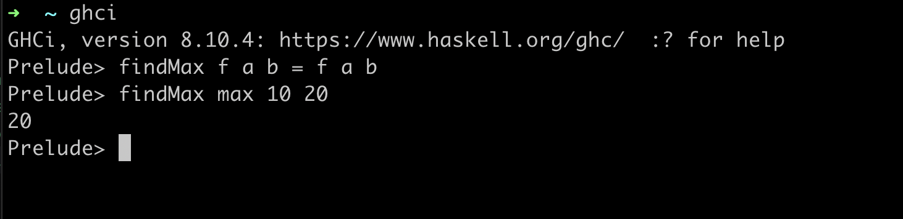

# WORK IN PROGRESS

# Haskell 101

## Introduction

_A `general-purpose, statically typed, purely functional, lazy evaluated` programming language, that will hurt you more than **your first breakup(no exaggeration).**_

**_A language that will make you feel like a noob, doesn't matter how many years of experience you have writing lame `JAVA` code._**

Born out of the complexities of [Lambda Calculus](https://en.wikipedia.org/wiki/Lambda_calculus) and [Category Theory](https://en.wikipedia.org/wiki/Category_theory), in the dark valleys of [Glasgow](https://en.wikipedia.org/wiki/Glasgow_Haskell_Compiler), `Haskell` nerds will make sure you leave that book after the preface and never come back because you realize, you are too dumb for this shit.

**A language so gorgeour, you will fall in love. A language so powerful, it will make your brain bigger(like physically bigger). A language so sick, even I don't understand half of it(but the other half, that's some kick ass stuff).**

## `Step[0]`

If you plan to try some of the examples, I would highly recommend setting up `Haskell` locally on your machine. You can follow [this](https://www.haskell.org/platform/) guide to download and setup `ghc` and `ghci`, we will using `ghci` for all examples.

**`Can't I just using an online compiler ??`**

Well, in theory sure, if you google, you can find some options, I have used [haskell replit](https://replit.com/languages/haskell) in the past, **_but_**(and "a big fat `but`, as far as `but's` go") there is a problem, you see currently, you are an `Haskell` baby, all you know is to cry, but these `REPL` environments are designed for grownups. And if I were to take you from a baby to grownup, we will have to talk about, what `purely functional` really means, and how all `IO` is impure and then I will have to tell you about how `Haskell` ended up going around that issue using the explict `IO Monad` and they you will ask what a `Monad` is, and then I will say, "whatever you want it to be" while simultaneously being something "no one really understands, we all just pretent" and then we will have to talk about that thing and then that thing and after a while, we reach stuff, even I don't understand and by then you will have a serious headache and man on man, a serious headache can cause permanent brain damage to a baby, so no I ain't taking that risk, just setup the f\*\*king thing on your machine locally.

<!-- ## Let's learn the half I understand

`Haskell` is a purely functional language, which is a just a fancy way of saying, no classes, no objects, functions can be passed around just like data.

Here is an example,

```haskell
findMax :: (Num a) => (a -> a -> a) -> a -> a -> a
findMax f a b = f a b
```



There is a lot going on in this example, and you will learn all these things as we go along, but for now just focus on the last line. We have a function called `findMax`, which takes a function `f` as its argument, which demonstrates the behavious.

`findMax max 10 20` used the inbuild function called `max` to find the bigger number of two passed as arguments.

Functions like `findMax` are sometimes also refered to as `Higher Order Functions`, which just means a function that either takes another function as argument or returns a function as its result, and if you are coming to this article with experience in one of the modern programming languages like `Javascript`, `Python`, etc, you have already seem functions accepting other functions as arguments, think of your `map`, `filter`, `reduce`, although functions returing other functions is a rare sight. But in `Haskell`, functions return other functions all the time and is a very important aspect of the language.

### Your first program, or two 😛😛

If you don't have the `Haskell` compiler installed already, I would recommend using the [Online Haskell REPL](https://replit.com/languages/haskell).

When you open the repl, you are greeted with the mandatory `helloworld` example, which is just printing the string using the inbuilt `putStrLn`.

`main = putStrLn "Hello, World!"` print "Hello, World!" to the screen.

Let's move on and define some variables, **Oppsie**, `Haskell` doesn't have those, happy to disappoint. `Haskell` doesn't have variables because all values are immutable, so you can't change any value once assign it to a name. There are some other nerdy details here, but we can ignore those. -->
